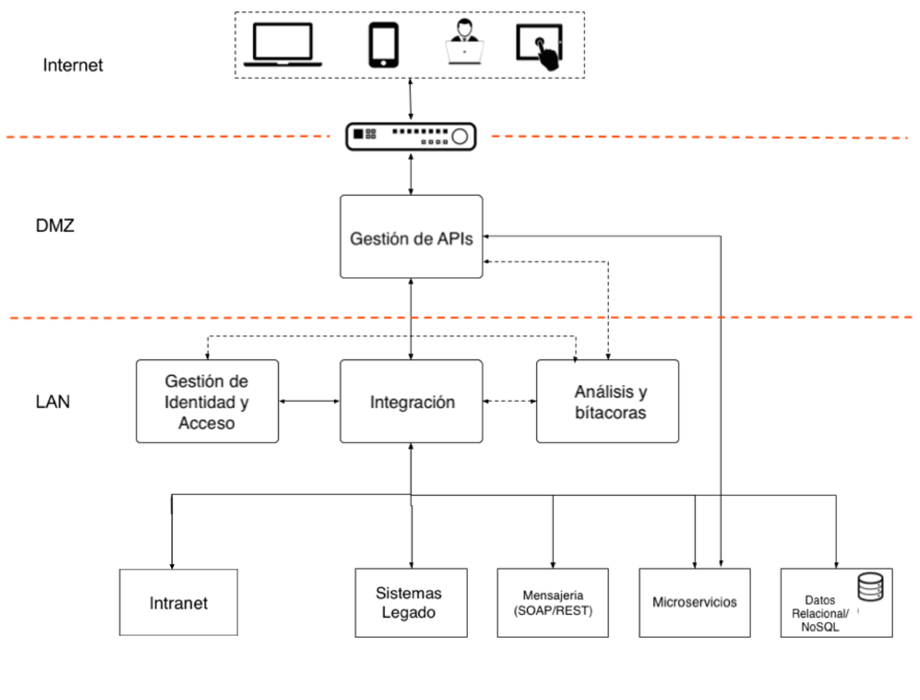

# Infraestructura del Servicio

Los líderes de Transformación Digital deben conocer nuevas tecnologías que pueden explotarse para crear oportunidades. Ademas es importante implementar nuevas tecnologías para mejorar servicios de forma gradual de forma que se aproveche la infraestructura ya existente.

 Las innovaciones dependen de una conectividad a Internet barata y confiable por esto es indispensable considerar soluciones en la nube y la agregación de datos a nivel de toda la sociedad, todos accesibles mediante [APIs](https://es.wikipedia.org/wiki/Interfaz_de_programaci%C3%B3n_de_aplicaciones). Además, para asegurar la experiencia de las personas usuarias, las soluciones de gobierno deben ser capaces de funcionar en modo desconectado hasta que se restablezca una conexión.

Por todo esto, el canal de entrega principal para la funcionalidad de una aplicación de gobierno será una API, teniendo en cuenta las diferentes formas en que se puede invocar y los posibles casos de uso.

* ¿Existen casos de uso diferentes para clientes internos y externos?
* ¿Existen diferentes requisitos de datos y volúmenes para clientes internos y externos?
* ¿Necesita aplicar diferentes niveles de seguridad?
* ¿Es necesario el servicio este disponible para diferentes tecnologías?

Esta información ayuda a los desarrolladores a enfocarse en construir aplicaciones que escalan fácilmente, cumplen con la demanda actual y responden a tecnologías emergentes tales como el internet de las cosas (IoT). Por último, es importante reconocer que las instituciones muchas veces tienen ya sistemas legado que fueron construidos como monolitos (tales como JEE), y será necesario hacer un rediseño de las mismas, o agregar una capa que exponga servicios a través de APIs.

**Entregables**

* Análisis de brechas y plan de gestión del cambio
* Modelo de infraestructura para despliegue de APIs institucionales: APIs de acceso Interno, APIs de acceso externo.
* Documentación de consumo de API desde múltiples plataformas: ventanilla de atención, quiosco electrónico, aplicación web, aplicación móvil.
* Plan de gestión de acceso y seguridad para APIs de consumo externo.

**Herramientas:**

* Desarrollo multiplataforma/multicanal con [Apache Córdova](https://cordova.apache.org/) 
* [Lineamientos de Interoperabilidad](https://www.gobiernoelectronico.gob.sv/?p=608)

* [Seguridad y acceso de APIs](https://github.com/shieldfy/API-Security-Checklist/blob/master/README-es.md)

Ejemplo de modelo de infraestructura y acceso multicanal:

