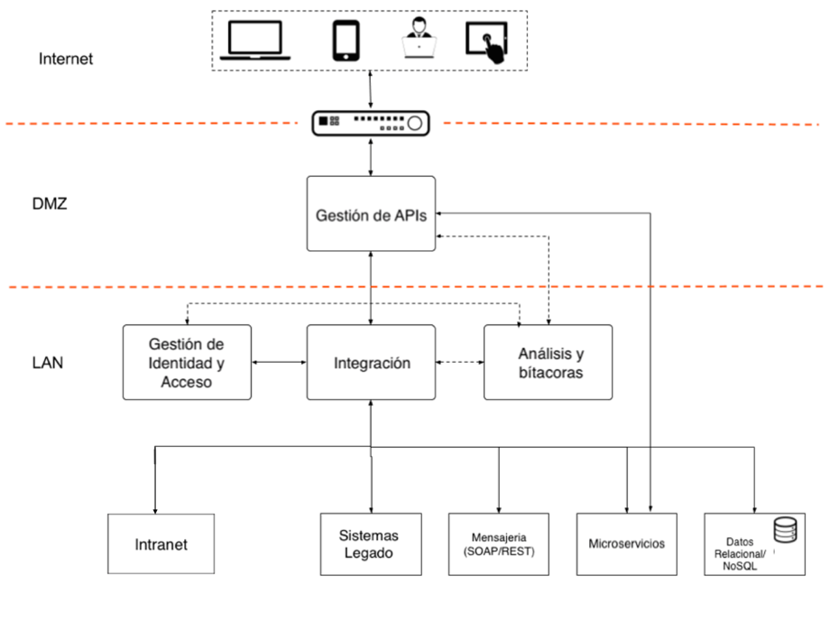

# Tecnologías y Aplicaciones

Las soluciones informáticas deben responder a las necesidades de los flujos de trabajo y gestión de datos de los servicios públicos. Para poder diseñar soluciones informáticas que soporten servicios integrados, es necesario usar estándares y tecnologías, que no tengan restricciones de uso y de acceso libre, que estén apoyados por comunidades de práctica. El uso de estándares garantiza el acoplamiento entre diferentes soluciones y son independientes de la tecnología que se utilice. Dichos estándares están disponibles en los [lineamientos de integración e interoperabilidad](https://egobsv.github.io/EstandaresInteroperabilidad/).

Por todo esto, el canal de entrega principal para la funcionalidad de una aplicación de gobierno será una API, teniendo en cuenta las diferentes formas en que se puede invocar y los posibles casos de uso.  Además, se recomienda re usar componentes tales como el motor de pagos electrónicos de gobierno (PAGOES), y el servicio de Atención Ciudadana (SAC). 

Para documentar las tecnologías que soportan un servicio de gobierno se sugiere empezar con las siguientes preguntas:

* ¿Quiénes son los usuarios del servicio?
* ¿Como se identifican y autorizan los usuarios del servicio?
* ¿Cuáles serán los canales de acceso que tendrán disponibles?
* ¿Cómo se protegen de los datos del servicio en tránsito y en reposo?
* ¿Cuáles son las interfaces (APIs) disponibles para interactuar con el servicio y su información?
* ¿Qué componentes reutilizables adopta la solución?

ENTREGABLES:

* [Diagrama de casos de uso del servicio](https://es.wikipedia.org/wiki/Diagrama_de_casos_de_uso)
* Plan de despliegue de APIs institucionales: APIs de acceso Interno, APIs de acceso externo.
* Ficha del servicio/API: URL, ejemplos de uso, información de contacto.

**Herramientas**

* [Servicio de atención ciudadana SAC](www.atencionciudadana.sv)
* [Gestor de Procesos SIMPLE](https://www.agesic.gub.uy/innovaportal/v/5588/11/agesic/sistema-para-la-implementacion-de-procesos-ligeramente-estandarizados-simple.html)
* [Gestor de Procesos Camunda](https://camunda.com/products/bpmn-engine/) 
* Compendio de herramientas para el [Desarrollo de APIs](https://github.com/yosriady/api-development-tools)
* Desarrollo multiplataforma/multicanal con [Apache Córdova](https://cordova.apache.org/) 

Ejemplo de modelo de infraestructura y acceso multicanal:

## Licencia

Este trabajo esta cubierto dentro de la estrategia de desarrollo de servicios de Gobierno Electrónico del Gobierno de El Salvador y como tal es una obra de valor público sujeto a los lineamientos de la Política de Datos Abiertos y la licencia [CC-BY-SA](https://creativecommons.org/licenses/by-sa/3.0/deed.es).  
